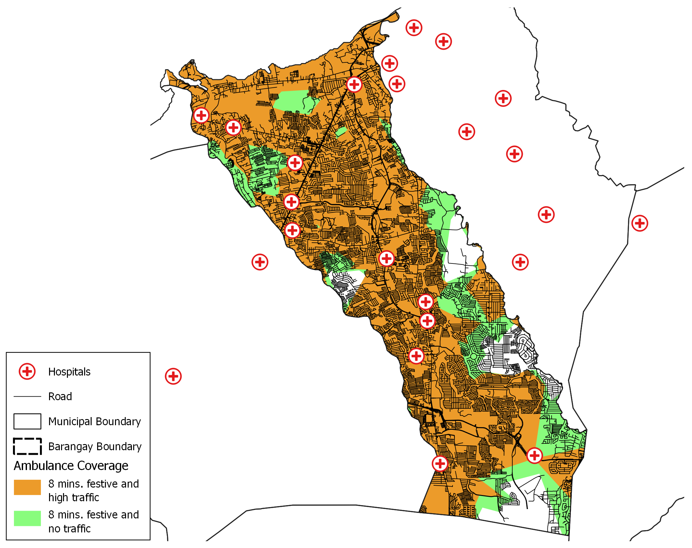

# Project Overview
## Identifying Areas Vulnerable to Delay of Emergency Medical Services and Transport of Patients in Bacoor, Cavite
Language: Python
Tools used: QGIS, Jupyter Notebooks
External libraries used: pandas, dotenv, numpy, folium, shapely, geopandas, matplotlib

Description:
This project aims to provide an idea on areas vulnerable to Emergency Medical Services (EMS) delay in Bacoor, Cavite brought about by traffic. I used the Tomtom Traffic API to obtain the area covered by EMS originating from hospitals. I obtained the hospital points of interest using OSM data, filtered it from QGIS, and exported the filtered dataset. I further processed the data into a CSV file in order to input it into the API. The output is a collection of polygons representing the area covered by EMS. I combined the polygons into one and used QGIS to represent the data into a map. Shown below are the results:

Normal day map:

Festive day map:

I also added another factor which is normal/festive day since I assumed festivity will also have an effect on the EMS coverage, yet it turns out it doesn't have a big effect based on the API output.

Provided are the notebooks and data which either came from QGIS or the notebooks. There is also the PDF file which describes the entire project.